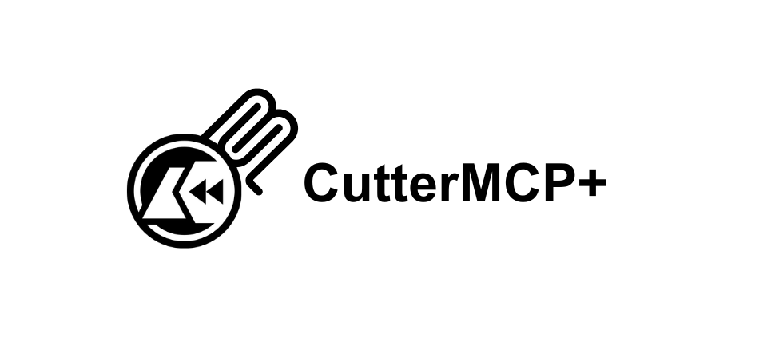

# CutterMCP+

Automated Reverse Engineering via LLMs

**[Cutter](https://cutter.re/) is a powerful, user-friendly, and completely free reverse engineering tool.**

**Now, combined with modern Large Language Models (LLMs), they can do even more.**

> 🤖 “Give AI a sharp cutter!”

## Demos

### Demo 1: Hackthebox [Behind the Scenes](https://app.hackthebox.com/challenges/Behind%2520the%2520Scenes) (Easy level illeagal instruction bypass, Level: very easy)

As demonstrated in the video below, this plugin enables Cutter to automatically solve simple reverse engineering CTF challenges(From hack the box).

The LLM can notice anti-analysis techniques such as illegal instruction `ud2`. In this case, `ud2` jammed the decompiler and produced incomplete result.

`claude-sonnet-3.7` noticed this and tried to read the assembly directly to get around it. The entire process took about a minute to find the correct answer, **without human intervention.**


https://github.com/user-attachments/assets/bc86df16-93e1-473f-8eb4-3161a7b4a48e


(The video has not been accelerated.)

### Demo 2: Hackthebox [Virtually Mad](https://app.hackthebox.com/challenges/Virtually%2520Mad) (VM analysis. Level: Medium)

This is a VM analysis challenge. You need to reverse the opcode and figure out the rules. There are functions that are called in key parts via function pointers, so these are not listed by cutter.

So, the more intelligent `claude-opus-4' was used.

With prompt: Let's do a CTF reverse analysis challenge. virtually.mad. this is an ELF file. Cutter MCP is ready for you. You can call cutter to help you complete the challenge.

With no intervention claude-opus-4 completed the challenge using cutter.


### Demo 3: [ShellcodeEncrypt2DLL](https://github.com/restkhz/ShellcodeEncrypt2DLL) (Malware sample, VirusTotal 0/72)

It can also assist in malware analysis workflows, helping you accelerate tasks or extract key information.

In my previous project, there was a **[shellcode loader](https://github.com/restkhz/ShellcodeEncrypt2DLL)**  that achieved a VirusTotal score of 0/72 (ehmm...at that time I mean), but it was unable to withstand analysis by LLMs.

The analysis results from `claude-opus-4` are completely correct, and the function has been renamed, a guess has been made: Hey, this is a shellcode loader.

**The entire process took a few minutes and also required no human intervention.**


## Available functionality:

`list_functions()`
`function_detail()`
`list_globals()`
`list_strings()`
`list_segments()`
`list_vars()`
`list_entry_points()`

`decompile()`
`disasm_text()`
`disasm_json()`
`disasm_by_func_text()`
`disasm_by_func_json()`

`xrefs_to()`

`rename_function()`
`rename_local_variable()`
`set_comment()`
`set_local_variable_type()`

`current_address()`
`current_function()`

`read_bytes()`

## How to use?

First, make sure that cutter and python3 are installed.

### Dependencies:

```
pip install -r requirements.txt
```

Dependencies refer to `requirements.txt`. If you encounter version conflict, consider different versions of dependencies.

The problem is cutter load plugin directly and bypassed uv. I will consider splitting the plug-in to ease dependency management later.

### Cutter plugin:

This is about the `mcp_plugin.py`. It will serve as a plugin of cutter and start a HTTP API server. `mcp_server.py` will rely on it to obtain information.

1. Run Cutter
2. Go to **Edit -> Preferences -> Plugins**
3. You can find the plugin directory location in the dialog.
4. Copy `mcp_plugin.py` to the `<cutter_plugins>/python` folder(not the `mcp_server.py`)
5. Restart your cutter

### MCP Host:

For example (in cline, cursor etc) in MCP config file:

```json
{
  "mcpServers": {
    "cuttermcp-plus": {
      "command": "python",
      "args": [
        "<ABSOLUTE/PATH/TO>/mcp_server.py"
      ]
    }
  }
}
```

### LLM

In most cases, `claude-sonnet-4` is good enough.

`gemini-2.5-pro` It can also solve the vast majority of tasks, and it’s a bit cheaper than sonnet-4.

I don't have permission to access OpenAI's `o3` model, so I didn't do any testing. `o4-mini` can also effectively solve simple CTF questions, but since I don't have permission, I won't provide the thought process.

Models such as `gemini-2.5-flash` and `gpt-4.1-mini` their performance may not be satisfactory.

## Is this safe?

For example, When analyzing malware the string in the data section may cause injection.
So, do not automatically agree to all execute commands.

Also, **be aware of the spending on tokens.**

## TODO

1. Save tokens. 
2. Split the plugin into two parts for convenient uv management.

## Special Thanks

**[Amey Pathak](https://ap425q.github.io/)**: Creator of the first [CutterMCP](https://github.com/ap425q/CutterMCP)

He's definitely cool. He got OSED certificate at the age of 19.

Without his project, this project probably wouldn't exist.
